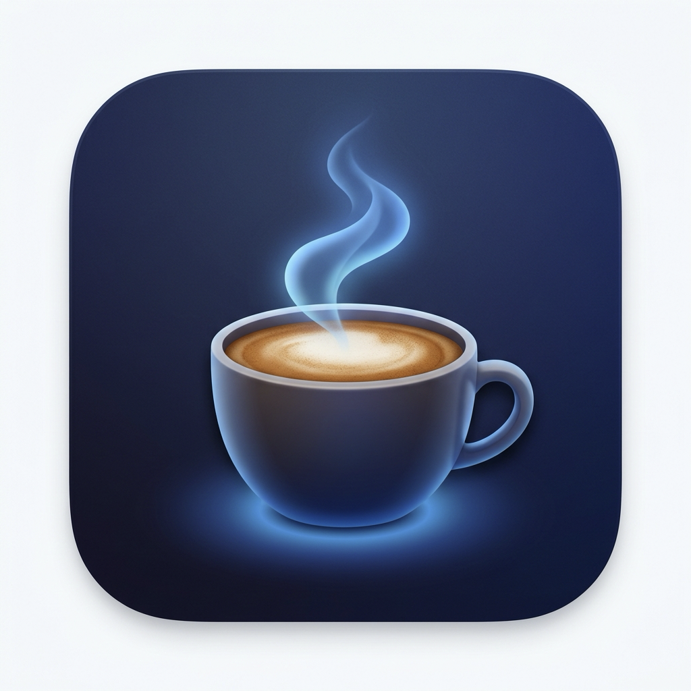

<p align="center">
  
</p>

<h1 align="center">KeepAwake</h1>

<p align="center">
  <strong>A native macOS menu bar app for keeping your Mac and display awake for the exact duration you choose.</strong>
</p>

<p align="center">
  <a href="https://github.com/adhamhaithameid/KeepAwake/releases">Download</a> ·
  <a href="docs/install-from-github.md">Install Guide</a> ·
  <a href="docs/faq.md">FAQ</a> ·
  <a href="docs/privacy.md">Privacy</a>
</p>

---

## Why KeepAwake?

KeepAwake is built for the moments when you want your Mac to stay awake without opening System Settings, Terminal, or a full desktop app window.

- **Menu bar first.** Left-click toggles your saved default duration. Right-click opens quick actions and the full duration list.
- **Built for real sessions.** Choose `15m`, `30m`, `1h`, `2h`, `3h`, `5h`, `8h`, `12h`, `1 day`, or `Indefinitely`, and add your own custom durations.
- **Battery-aware.** Optionally stop when battery drops below a chosen threshold or when Low Power Mode turns on.
- **Native and lightweight.** Built with Swift, SwiftUI, AppKit interop, and macOS power assertions.
- **No special permissions.** KeepAwake does not require Accessibility or Input Monitoring access.

## Quick Start

1. Download the latest [release](https://github.com/adhamhaithameid/KeepAwake/releases).
2. Move `KeepAwake.app` to your Applications folder.
3. Open it once. The coffee cup icon appears in the menu bar.
4. Left-click the icon to start the saved default duration.
5. Right-click the icon for quick actions, settings, and the full duration list.

> [!TIP]
> If macOS warns about an unsigned app, right-click `KeepAwake.app`, choose **Open**, then confirm **Open** in the dialog.

## Features

### Menu Bar Control

- **Left click:** start or stop the saved default duration.
- **Right click:** use the quick buttons (`15m`, `1h`, `∞`), open the full duration submenu, open Settings, or quit the app.
- **Status icon:** outline coffee when inactive, filled coffee when active.

### Settings

- **Start at login**
- **Activate on launch**
- **Deactivate below battery threshold**
- **Deactivate in Low Power Mode**
- **Allow Display Sleep**

### Activation Duration

- Add custom durations with hours, minutes, and seconds
- Remove custom durations
- Reset the duration list
- Set any available duration as the saved default

### About

The About page keeps the same simple link-focused structure with GitHub, donation, and author profile actions.

## No Special Permissions

KeepAwake uses macOS power-management assertions to keep the system awake. It does not need:

- Accessibility
- Input Monitoring
- Screen Recording

The only OS-managed prompt you may see is the normal login-item approval flow if you enable **Start at login**.

## Documentation

| Guide | What it covers |
|---|---|
| [Install Guide](docs/install-from-github.md) | Install and first launch |
| [FAQ](docs/faq.md) | Common questions |
| [Manual Testing](docs/manual-testing.md) | Quick verification checklist |
| [Safety](docs/safety.md) | How auto-stop options protect battery life |
| [Troubleshooting](docs/troubleshooting.md) | Common fixes |
| [Privacy](docs/privacy.md) | Data and permissions |
| [Architecture](docs/architecture.md) | How the app works |
| [Uninstall](docs/uninstall.md) | Full removal steps |

## Build From Source

```bash
git clone https://github.com/adhamhaithameid/KeepAwake.git
cd KeepAwake
xcodegen generate
xcodebuild -project KeepAwake.xcodeproj -scheme KeepAwake -configuration Release build
```

**Requirements:** macOS 13.0 or later · Xcode 15+ · [XcodeGen](https://github.com/yonaskolb/XcodeGen)

## Support

If KeepAwake is useful, you can support the project here:

<a href="https://buymeacoffee.com/adhamhaithameid">
  
</a>

## License

Source-available under the [PolyForm Noncommercial 1.0.0](LICENSE.md) license.
